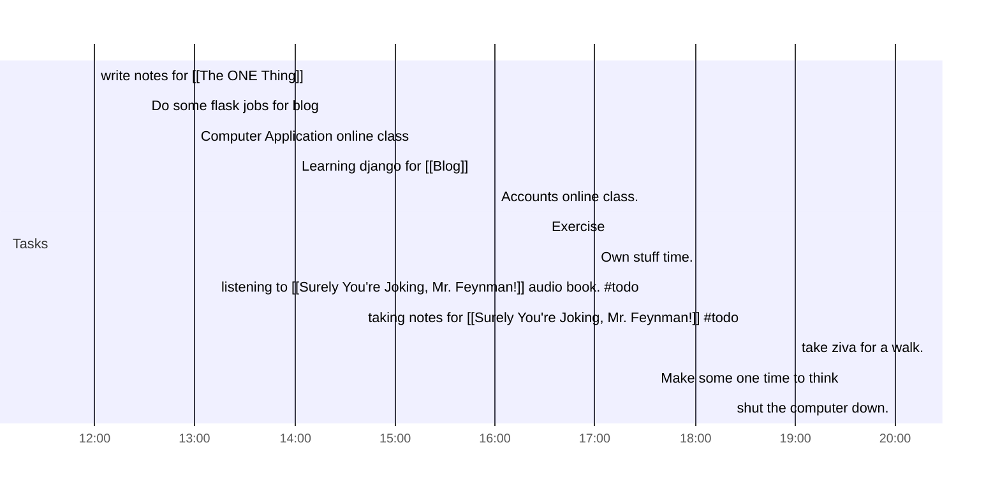

## Day Planner

- [x] 12:00 write notes for [[The ONE Thing]]
- [x] 12:30 Do some flask jobs for blog
- [x] 13:00 Computer Application online class
- [ ] 14:00 Learning django for [[Blog]]
- [ ] 16:00 Accounts online class.
- [ ] 16:30 Exercise
- [ ] 17:00 Own stuff time.
- [ ] 17:30 listening to [[Surely You're Joking, Mr. Feynman!]] audio book. #todo
- [ ] 18:30 taking notes for [[Surely You're Joking, Mr. Feynman!]] #todo
- [ ] 19:00 take ziva for a walk.
- [ ] 19:30 Make some one time to think
- [ ] 20:00 shut the computer down.