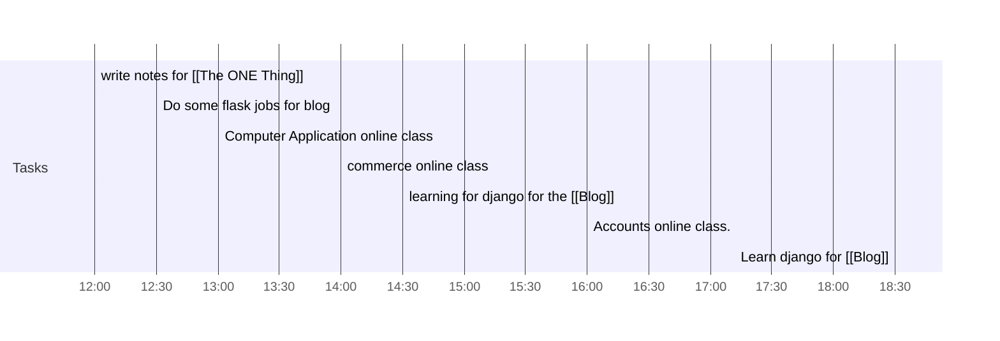

## Day Planner

- [x] 12:00 write notes for [[The ONE Thing]]
- [x] 12:30 Do some flask jobs for blog
- [x] 13:00 Computer Application online class
- [x] 14:00 commerce online class
- [x] 14:30 learning for django for the [[Blog]]
- [x] 16:00 Accounts online class.
- [x] 18:30 Learn django for [[Blog]]