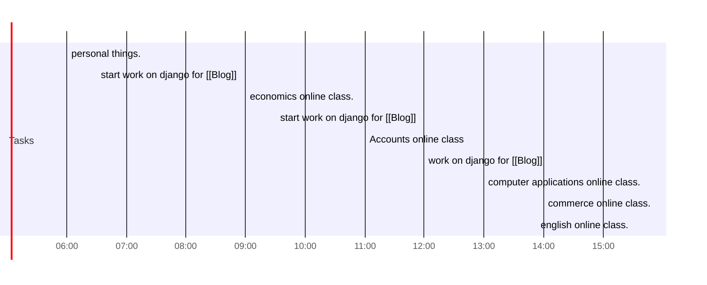

## Day Planner

- [x] 06:00 personal things.
- [x] 06:30 start work on django for [[Blog]]
- [x] 09:00 economics online class.
- [x] 09:30 start work on django for [[Blog]]
- [x] 11:00 Accounts online class
- [x] 12:00 work on django for [[Blog]]
- [x] 13:00 computer applications online class.
- [x] 14:00 commerce online class.
- [x] 15:30 english online class.
